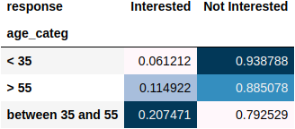
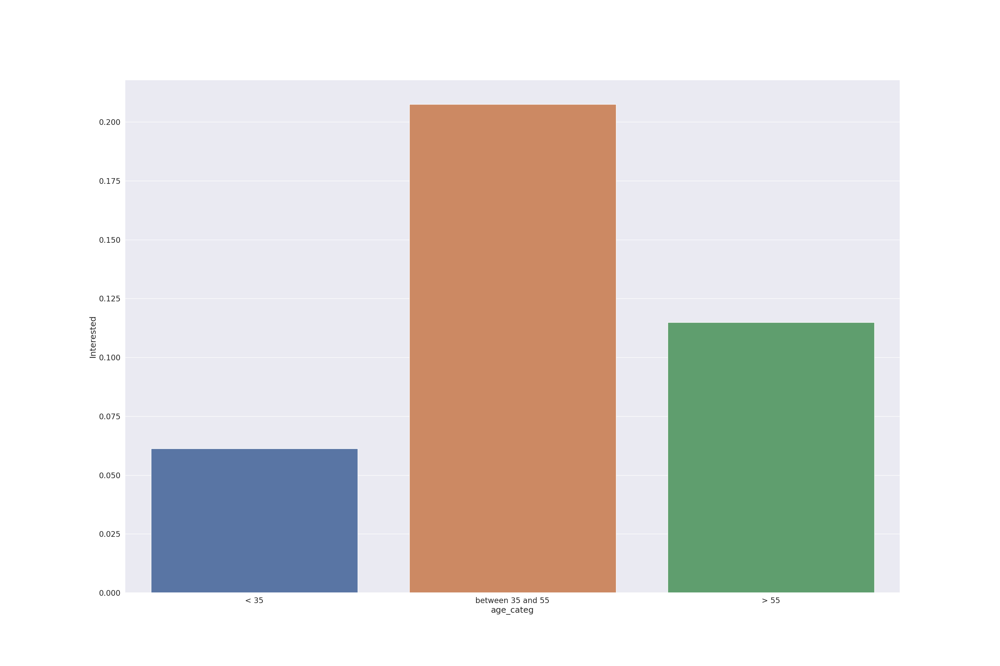
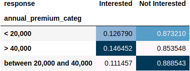
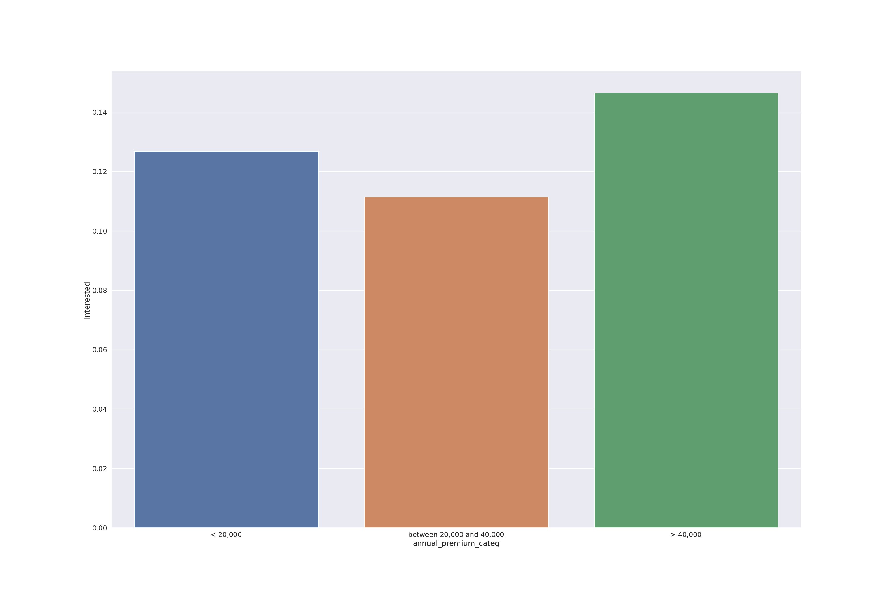
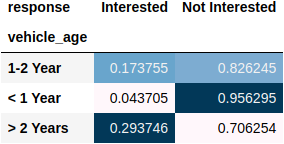
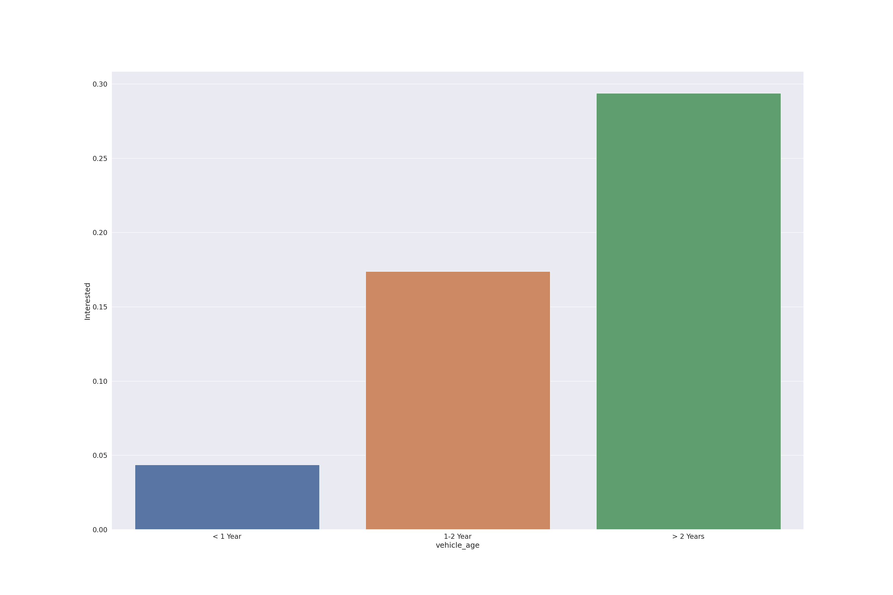
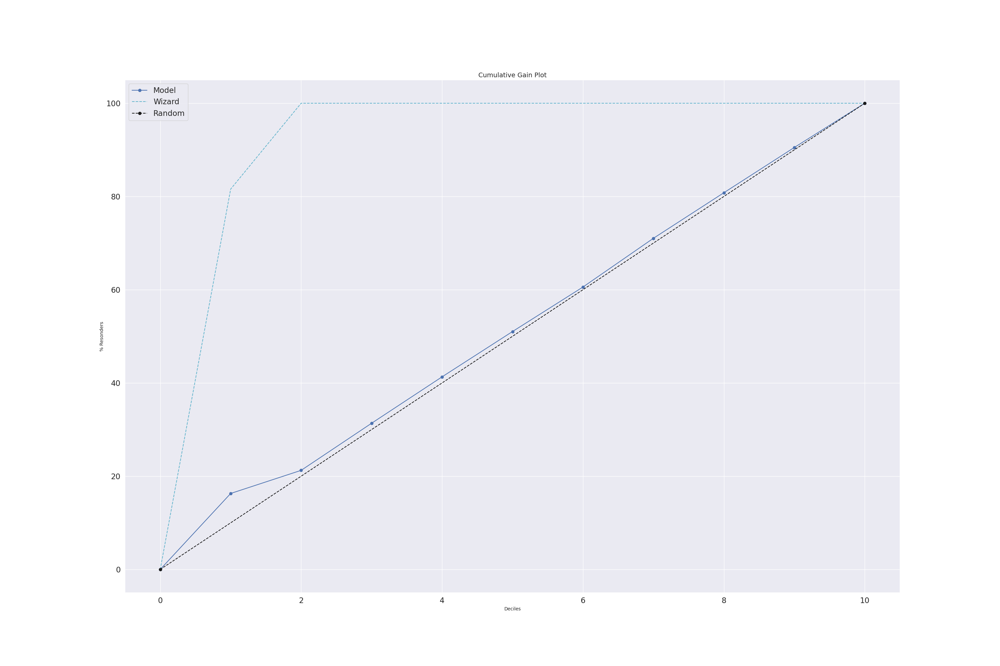
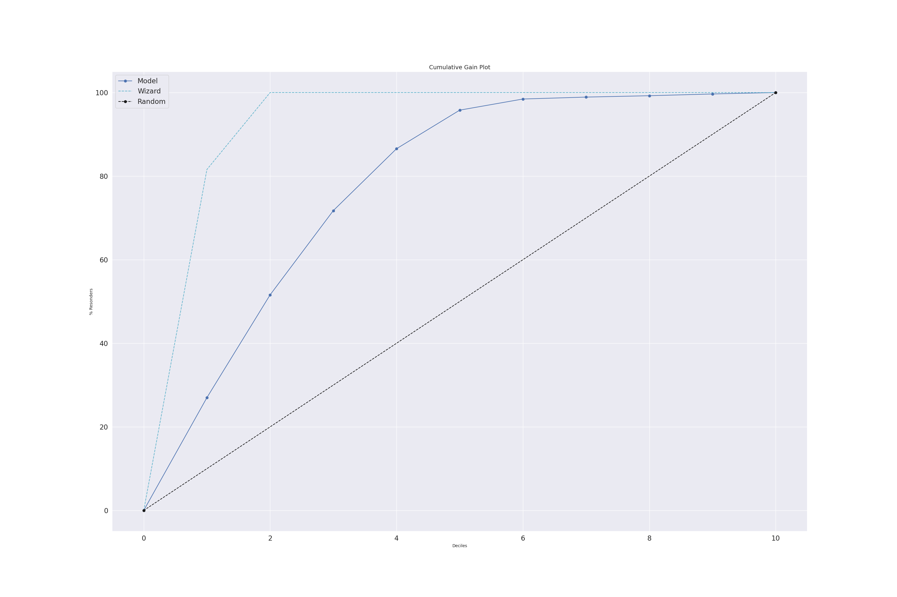
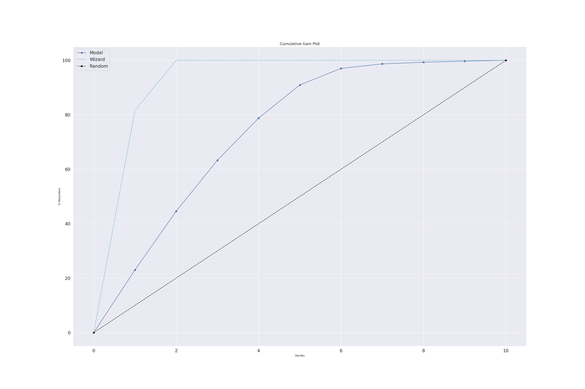

# Health insurance cross-sell

## 1. Introduction
This is an end-to-end data science project which a classification algorithm was used to rank clients which would be interested in getting a car insurance. It was used machine learning Random Forest algorithm to sort these clients.

# 2. Business Problem.

A health insurance company would like to offer car insurance to their clients and would like to know which of them would be interested in getting it. Also, they would like to rank those clients sorting them by highest chance of making this cross-sell.

Therefore, instead of contacting their client randomly to offer this insurance they will get a sorted list to be more effective in converting this deal.

# 3. Business Assumptions.

* it was considered that clients associated with the company for less than 30 days would receive a value of 1 in vintage_month feature.

# 4. Tools used
* Python
* Jupyter Lab
* Git and Github
* Flask and Python API's
* Sklearn

# 5. Dataset

Dataset contains 381,109 rows and 12 columns and it contains the following variables:

* id - Unique ID for the customer

* Gender - 	Gender of the customer

* Age -	Age of the customer

* Driving_License -	0 : Customer does not have DL, 1 : Customer already has DL

* Region_Code - Unique code for the region of the customer

* Previously_Insured - 1 : Customer already has Vehicle Insurance, 0 : Customer doesn't have Vehicle Insurance

* Vehicle_Age -	Age of the Vehicle

* Vehicle_Damage - 1 : Customer got his/her vehicle damaged in the past. 0 : Customer didn't get his/her vehicle damaged in the past.

* Annual_Premium - The amount customer needs to pay as premium in the year

* PolicySalesChannel - Anonymized Code for the channel of outreaching to the customer ie. Different Agents, Over Mail, Over Phone, In Person, etc.

* Vintage -	Number of Days, Customer has been associated with the company

* Response - 1 : Customer is interested, 0 : Customer is not interested

# 6. Solution Strategy

My strategy to solve this challenge was:

This project was developed following CRISP-DM (Cross-Industry Standard Process - Data Science) framework. This framework has these steps:

* Business Understanding;
* Data Collection;
* Data Cleaning;
* Exploratory Data Analysis (EDA);
* Data Preparation;
* Machine Learning Modelling and fine-tuning;
* Model and Business performance evaluation / Results;
* Model deployment.

**Step 1. Data description and cleaning:** Seeing dimensions of data, checking existence of NAs, number of rows and columns. Fillout NAs, altering columns names,  Descriptive statistics.

**Step 2. Feature engineering**: Creation of a mindmap hypothesis with all variables and values that could have impact on sales. After that, some features was created from current ones

**Step 3. Exploratory Data Analysis (EDA)**: Univariate, bivariate and multivariate analysis. Checking correlation between response variable and explanatory ones. Hypothesis testing.

**Step 4. Data preparation**: Rescaling and encoding features so they could be used in machine learning algorithms properly.  Transformation of response variable

**Step 6. Feature selection**: Selecting the most important features to predict sales through Boruta algorithm, feature importance and permutation importance. Also there is a split in dataset creating train and test data.

**Step 7. Machine learning modelling**: Testing machine learning algorithm to find out which one has best performance in prediction. Performance was evaluated using cross-validation.

**Step 8. Hyperparameter tunning**: Random search technique was used to find out the best hyperparameters that maximizes performance of choosen model in last step.

**Step 9. Translation of modelling performance in business performance**: Modelling performance was analyzed in a business perspective.

**Step 10. Deploy mode to production**: Model was deployed in a cloud environment so stakeholders could have access to predictions.

# 7. Top 3 Data Insights

**Hypothesis 01:** The proportion of customers with more than 55 years old interested in getting a car insurance is 15% higher than customers between 35 and 55 years old

**True/False:** False. In fact the proportion of customers between 35 and 55 years old interested in getting a car insurance is almost double of proportion of customers who has more than 55 years old.

**Hypothesis 02:** The proportion of customers who pays more than $40,000 in their health insurance and are  interested in getting a car insurance is 20%  higher than customers who pays less than $20,000

**True/False:** False. The proportion of customers who pays more than $40,000 in their health insurance is approximately 15\% higher than who pays above $20,000. Chi-squared test shows we can reject the null hypothesis of independence.

**Hypothesis 03:** The proportion of customers whose cars have less than 1 year old and are interested in getting a car insurance  is 15% higher than customers whose cars have more than 2 years old.

**True/False:** False. The proportion of customers who have cars with more than 2 years and are interested in getting a car insurance is about 700% higher than customers with newer cars (less than a year).

# 8. Machine Learning Model Applied and performance
Three classification models were tested: XGBoost, Random Forest and Naive Bayes.

Cumulative gain curves are below, showing XGBoost and Random Forest almost had same results. 

Gain curves basically shows how many times applying a model for select records is better than randomly choose these records for any percentage of them. 

For instance, suppose that just 20% of all clients are interested in getting a car insurance. So one takes a proportion of 25% of the sample and it is expected that 20% of this proportion of clients are interested in a car insurance considering randomly selection. If a model ranks these clients by their interested in car insurance it could archieve a proportion higher than 20% in these 25% sample proportion. 

The higher this proportion the better will be the model compared to randomly select clients.

It was chosen Random Forest model and below one can see its performance with hiperparameters tuned. The lift score of this final model was 3.50, which means that this model is 3.50 times better than randomly select clients.

# 9. Business Results
It is possible to simulate some scenarios based on the capacity of the company to make contact with clients, since there are some costs in archieving them.

if the company could just contacting 30% of all their clients (assume this percetage is 20,000 clients), the model will rank the clients with best probability of getting the car insurance and approximately 70% (14,000) of these chosen clients would be interested in acquiring the car insurance.

# 10. Conclusions

The model did a good job in selecting clients for the company to make a cross-sell sale. It helps company reduce its costs of contacting a client as it will be more selective in which clients it should contact. Also the model would increase company revenue as they would select probably clients to acquire its car insurance.

# 11. Next Steps to Improve

The next CRISP-DM circle one can do the following:

* Trying to get more features about the client as their income, number of family members, their jobs.
* Trying to get more features about their cars, how many cars they have for instance.
* Training another models such as LightGBM and Support Vector Machine (SVM) to check whether performance could be improved.

